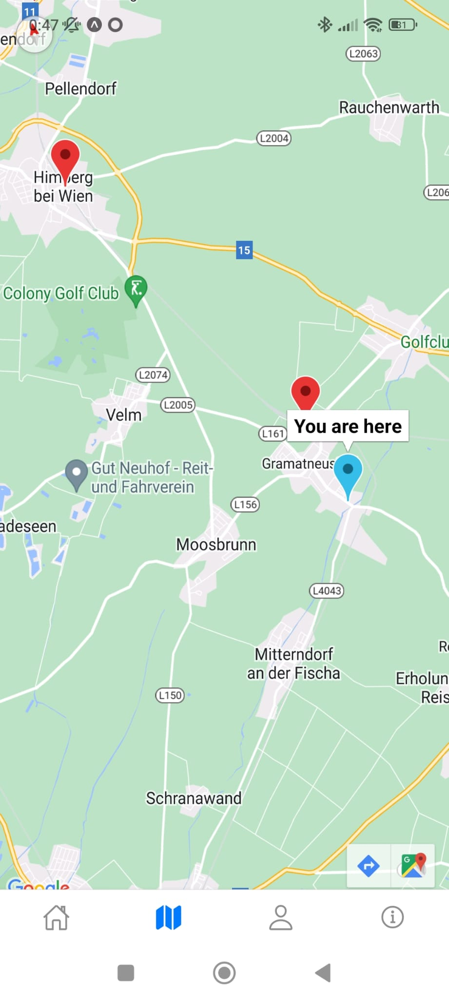

# Wiener Linien App

For my university course, I've developed a React Native Expo app that displays Wiener Linien stations on a map in
Austria. This app leverages geolocation to show your current location in real-time. It's designed to help users easily
navigate the Wiener Linien network. The remote build feature via Expo ensures seamless updates.

